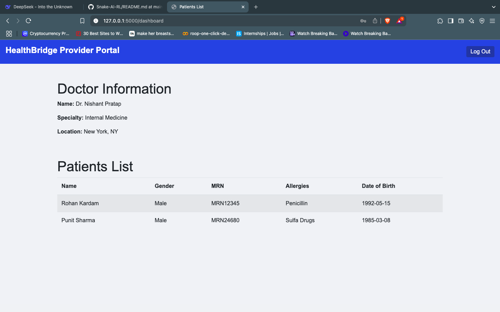

# Healthbridge

`Short Description`: Healthbridge is a cloud data storage and manage data storage for Doctors, Patients and Organisations.


A secure, centralized platform for patients, doctors, and organizations to store, access, and share health records globally using unique IDs.

## Made By:
`Code Breakers`

- [Ansh Arora](https://github.com/Ansh04Arora)
- [Nishant](https://github.com/Nishant232)
- [Nishant Pratap](https://github.com/Nishant2009)
- [Punit Sharma](https://github.com/punit2211)
- [Rohan Kardam](https://github.com/ITSR0HANHERE)

---

## Table of Contents
- [Features](#features)
- [Installation](#installation)
- [Usage](#usage)
- [Screenshots](#screenshots)
- [Configuration](#configuration)
- [Contributing](#contributing)
- [License](#license)
---
## Features
- **Patients**: View and share health records via unique ID.
- **Doctors**: Access patient data and update medical prescriptions.
- **Organizations**: Monitor aggregated health trends and compliance can update new data `eg: medical report`

---

## Installation
### Windows
1. Steps to Run:
Install all requirements (if not already installed):
``` bash
pip install -r requirements.txt 
```

2. Run the app:
``` bash
python app.py
```
3. Open your browser and visit `http://127.0.0.1:5000/`

### Linux/Mac:
1. Steps to Run:
Install all requirements (if not already installed):
``` bash
pip install -r requirements.txt 
```

2. Run the app:
``` bash
sudo python3 app.py
```
3. Open your browser and visit `http://127.0.0.1:5000/`
---

## Usage
### For Patients:
- Log in with your E-Mail ID.
- View your Medical reports, Prescriptions, and other medical details.

### For Doctors:
- Search patients by Health ID.
- Access real-time lab results and prescribe treatments.

### For Organizations:
- Generate analytics reports on public health trends.
- Manage doctor and patient registrations.
---
## Screenshots
- Login Userinterface  for Patients, Admins, Doctors, labtechenician


- User-Interface for Patients


- User-Interface for ADMIN DASHBOARD


- User-Interface for lab techenician


- User-Interface for doctors



---
## Contributing
1. Fork the repository.
2. Create a feature branch: `git checkout -b feature/new-feature`.
3. Commit changes: `git commit -m 'Add new feature'`.
4. Push to the branch: `git push origin feature/new-feature`.
5. Submit a pull request.

---

## License

This project is licensed under the MIT License. See [LICENSE](LICENSE) for details.

---

## Contact
For any queries, [Mail Here](mailto:nishantpartapsavita1@gmail.com)

